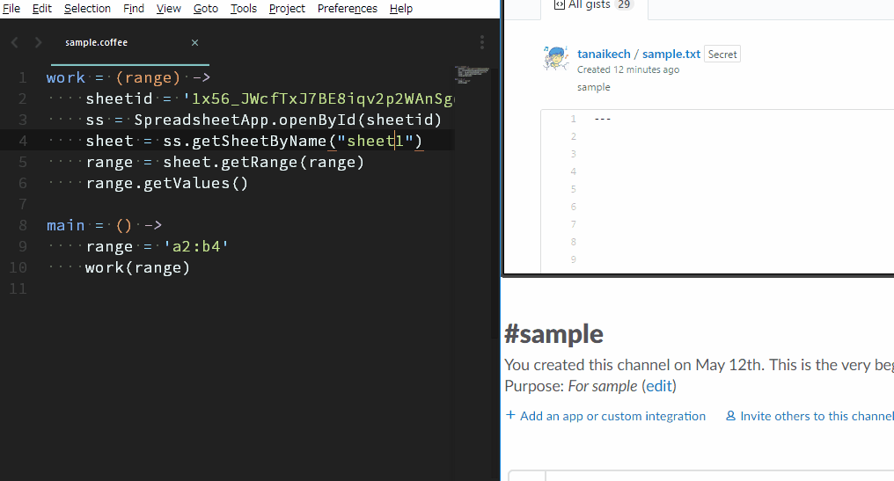

gislacks
=====

# Overview
This is a plugin of Sublime Text 3 for submitting files to both Gist and Slack.

# Description
I like to use Sublime Text for developing scripts. And when I discuss about developing scripts, I often use Slack. When I submitted a script to Slack, I had saved the script to Gist as a backup. I had done manually this on my browser. Namely, I wanted to be saving the revision of script while I'm discussing about the script at Slack. One day, I wished this process had been able to be automatically run. So I created this plugin and [gislack of a CLI tool](https://github.com/tanaikech/gislack/).

I had created and used this by only myself, Recently, I thought that this also might be useful for other developers. So I published this. If you felt this is useful, I'm glad.

By this, the local environment for developing Google Apps Script (GAS) became more convenient.

# Features

1. **Submits files to both Gist and Slack, simultaneously.**

2. **Submits, gets and updates files for Gist.**

3. **Submits, gets files for Slack.**

4. **Retrieves access token from client ID and client secret for Gist and Slack.**

# Demo
This is a demonstration for submitting a GAS written by CoffeeScript to both Gist and Slack using Sublime Text. You can confirm that the revision of script uploaded to gist increases. The Google Apps Script is run by [ggsrun](https://github.com/tanaikech/ggsrun).

# How to Install
This plugin is constructed with following 2 tools.

## 1. Install gislacks
This is the plugin for Sublime Text 3.

This was published at [https://packagecontrol.io/packages/gislacks](https://packagecontrol.io/packages/gislacks).

1. Launch Sublime Text
1. Preferences -> Package Control -> Package Control: Install Package
1. Choose gislacks

If you want to install directory the repository, you can use as following flow.

1. Open Package Control by ``ctrl+shift+p`` (Windows, Linux) or ``cmd+shift+p`` (OS X)
1. Select Add Repository at Package Control.
1. Input [https://github.com/tanaikech/gislacks](https://github.com/tanaikech/gislacks). This is a repository of gislacks on GitHub.
1. Select Install Package at Package Control.
1. Find gislacks and select it. By this, gislacks is installed on your Sublime Text 3.

## 2. Install gislack
This is a CLI tool which is the interface between Sublime Text and Gist, Slack.

Download an executable file of gislack from [the release page](https://github.com/tanaikech/gislack/releases) and import to a directory with path.

or

Use go get.

~~~bash
$ go get -u github.com/tanaikech/gislack
~~~

If you want to compile this on your PC, please also get a library [https://github.com/tanaikech/getcode](https://github.com/tanaikech/getcode).

# Retrieve Client ID and Client Secret
In order to use the plugin gislacks, at first, please retrieve client ID and client secret from GitHub and Slack.

## 1. Gist (GitHub)
1. Login to GitHub.
1. Open **Developer applications** page. [https://github.com/settings/developers](https://github.com/settings/developers)
1. Click **Register new application** button.
1. Input Application name, Homepage URL, Application description, Authorization callback URL. Authorization callback URL is ``http://localhost:8080``.
1. After inputted the information, click register application.
1. Copy **Client ID** and **Client Secret**.

## 2. Slack
1. Login to Slack.
1. Open **Your Apps** page. [https://api.slack.com/apps](https://api.slack.com/apps)
1. Click **Create New App** button.
1. Input App Name and Development Slack Team.
1. After inputted the information, click Create App.
1. Click **OAuth & Permissions** at left side or **Permissions** at Add features and functionality.
1. Click **Add a new Redirect URL**.
1. Input ``http://localhost:8080`` as a new Redirect URL.
1. Click Save URLs
1. Click **Basic Information** at left side.
1. Copy **Client ID** and **Client Secret** at App Credentials. When you see Client Secret, click the show button.

---

# Usage
## 1. gislacks.sublime-settings
At first, please modify ``gislacks.sublime-settings`` at Preferences -> Package Settings -> gislacks -> Settings-User. And please open your working folder by "File -> Open Folder". The working folder is used as a saved place of file from Gist and Slack.

~~~
// gislack default settings.
//
{
    // Path of gislack which is an execution file made by golang.
    // If gislack is put in defined path, it is not necessary to set this.
    "gislack_path": "",

    // Path of gislack.cfg. If you want to use gislack.cfg at except for current working directory, please use this.
    // If gislack.cfg is put in current working directory, it is not necessary to set this.
    // This path is used with the highest priority.
    "gislack_cfgpath": "",

    // Channel on Slack. This is a channel name you want to submit.
    // For channel name, the top `#` is not required.
    "slack_channel": "general",
}
~~~

## 2. Authorization
As a next step, <u>**please retrieve access token from Gist (GitHub) and Slack using each client ID and client Secret**</u>.

If you want to retrieve each access token using this plugin, please check [here](https://github.com/tanaikech/gislacks/tree/master/authbysublime).

### Authorization by Terminal
1. Launch your terminal.
1. Run following code. Please run following commands for GitHub and Slack.

**For Gist (GitHub)**

~~~bash
$ gislack auth -gi [client ID of GitHub] -gs [client secret of Github]
~~~

**For Slack**

~~~bash
$ gislack auth -si [client ID of Slack] -ss [client secret of Slack]
~~~

Following flow is the same to GitHub and Slack.

- When above is run, your browser is launched and waits for login to GitHub (or Slack).
- Please login to GitHub (or Slack).
- It opens authorization page. If the authorization button appears, please authorize it. If the button cannot be seen, a page with authorization code is opened.
- The authorization code can be retrieved automatically. And ``Done``. is displayed on your terminal.
    - If your browser isn't launched or spends for 30 seconds from the wait of authorization, it becomes the input work queue. This is a manual mode. Please copy displayed URL and paste it to your browser, and login to GitHub (or Slack). A code is displayed on the browser. Please copy it and paste it to your terminal during the input work queue. If you cannot find the code on your browser, please check the URL of your browser.
- When ``Done`` is displayed on your terminal, the authorization is completed and ``gislack.cfg`` is created on a directory you currently stay. (If you set ``cfgdirectory`` as an option, ``gislack.cfg`` is created to the directory set by ``cfgdirectory``.)
- The priority of directory for ``gislack.cfg`` is as follows.
    1. Option ``--cfgdirectory=#####`` or ``-cfgdir #####``.
    1. Environment variable : ``GISLACK_CFG_PATH`` (For example, you can write this for ``.bashrc`` as ``export GISLACK_CFG_PATH=#####``.)
    1. Current working directory.

Retrieved access tokens from GitHub and Slack have no limitation time. So the authorization process is only one time.

**Congratulation! Here, the preparation for using gislacks   was completed.**

## 3. How to Submit File from Sublime Text using Plugin gislacks
Following explanations are for Sublime Text 3 using the plugin gislacks. <u>In order to prevent miss for using shortcuts, the delete commands cannot be used at Sublime Text.</u>

**If following shortcuts are duplicated to your environment, please modify ``Default (Windows).sublime-keymap`` or ``Default (OSX).sublime-keymap`` or ``Default (Linux).sublime-keymap``.**

|   Works   |   Default shortcut key (Windows, Linux)   |   Default shortcut key (OS X)   | Command Palette ``ctrl + shift + p``, ``cmd + shift + p`` |
|:----------|:----------:|:----------:|:----------:|
| [New Submission for Slack and Submission with Revision for Gist](#demo) ***1** | ``ctrl + alt + w`` | ``cmd + option + w`` | gislacks: Submit to Gist (update) and Slack |
|New Submission for Slack and Gist | ``ctrl + alt + e`` | ``cmd + option + e`` | gislacks: Submit to Gist and Slack |
| [New Submission for Gist](#updategistdemo) ***2** | ``ctrl + alt + a`` | ``cmd + option + a`` | gislacks: Submit to Gist |
| [New Submission for Slack](#getslackfiledemo) | ``ctrl + alt + s`` | ``cmd + option + s`` | gislacks: Submit to Slack |
| [Get Gist](#updategistdemo) ***3** | ``ctrl + alt + z`` | ``cmd + option + z`` | gislacks: Get Gists |
| [Update Gist](#updategistdemo) | ``ctrl + alt + x`` | ``cmd + option + x`` | gislacks: Update Gists |
| [Get Gist History](#updategistdemo) | ``ctrl + alt + c`` | ``cmd + option + c`` | gislacks: Get Gist History |
| [Get Slack Files](#getslackfiledemo) | ``ctrl + alt + v`` | ``cmd + option + v`` | gislacks: Get Slack Files |
| Get Access Token from Gist (GitHub) | ``ctrl + alt + b`` | ``cmd + option + b`` | gislacks: Authorization Gist |
| Get Access Token from Slack | ``ctrl + alt + n`` | ``cmd + option + n`` | gislacks: Authorization Slack |

- ***1**: When it submits a file to both. After first submission was done, the file name is changed from original to the name included gist ID. This plugin updates the gist using this gist ID. Don't worry. The original file is not deleted.
- ***2**: At Sublime Text, several files can not be uploaded as a gist. If you want to upload several files as a gist, please use [gislack](https://github.com/tanaikech/gislack/) on terminal.
- ***3**: At Sublime Text, a gist included several files can not be opened. If you want to get a gist with several files, please use [gislack](https://github.com/tanaikech/gislack/) on terminal.

<u>If you want to submit your files on your terminal, you can use [gislack of CLI tool](https://github.com/tanaikech/gislack/).</u>

### Other Demonstrations

#### Get Gist and Update It
By ``ctrl + alt + t`` (Windows, Linux) or ``cmd + option + t`` (OS X), the list of gists is opened. When you select one of them, the selected gist is opened on Sublime Text. After you modified the file, by ``ctrl + alt + y`` (Windows, Linux) or ``cmd + option + y`` (OS X), the selected gist is updated by the modified file.

The flow of this demo is as follows.

1. Retrieve a Gist.
1. Retrieve one more Gist.
1. Run the Gist
1. Modify the retrieved Gist.
1. Run the modified Gist.
1. Upload the modified Gist.
1. Retrieve a version from the Gist's history.
1. Run the retrieved Gist.

#### Get Slack File
By ``ctrl + alt + i`` (Windows, Linux) or ``cmd + option + i`` (OS X), the list of slack files is opened. When you select one of them, the selected file is opened on Sublime Text. In the case of Slack, the file cannot be updated.

The flow of this demo is as follows.

1. Retrieve a file from Slack.
1. Run the file
1. Upload the file.

# References
## APIs
- Gist API document [https://developer.github.com/v3/gists/](https://developer.github.com/v3/gists/)
- Slack API document [https://api.slack.com/methods](https://api.slack.com/methods)

## Controlling gislack by JSON
gislack can be controlled by JSON data. Using this, gislack may be used except for Sublime Text. The parameters for JSON can be seen at ``useJSON()`` in ``handler.go`` on [https://github.com/tanaikech/gislack](https://github.com/tanaikech/gislack).

# Update History

* v1.0.0 (June 22, 2017)

    Initial release.

* v1.0.1 (June 22, 2017)

    Modify Key Bindings.

[TOP](#TOP)
