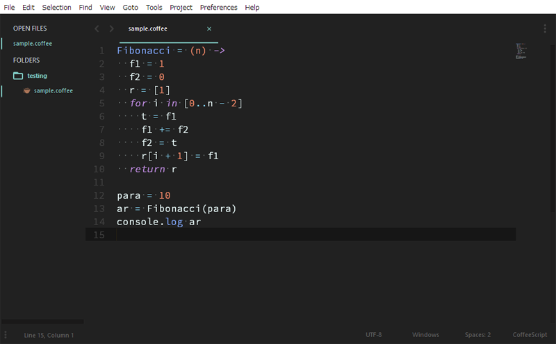
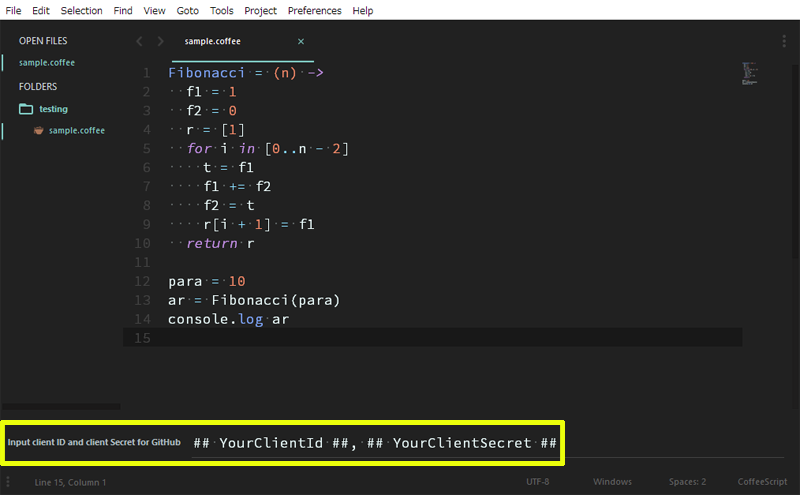
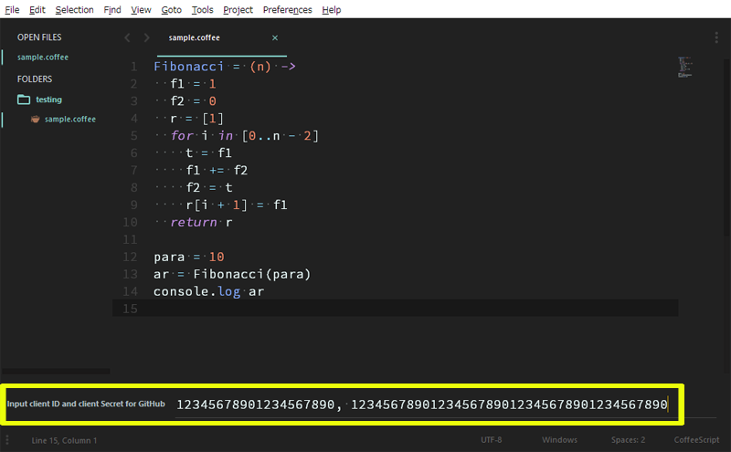
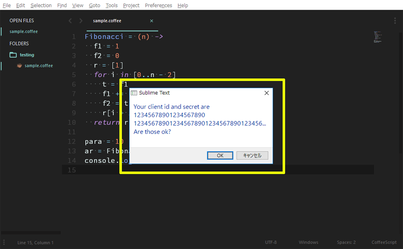
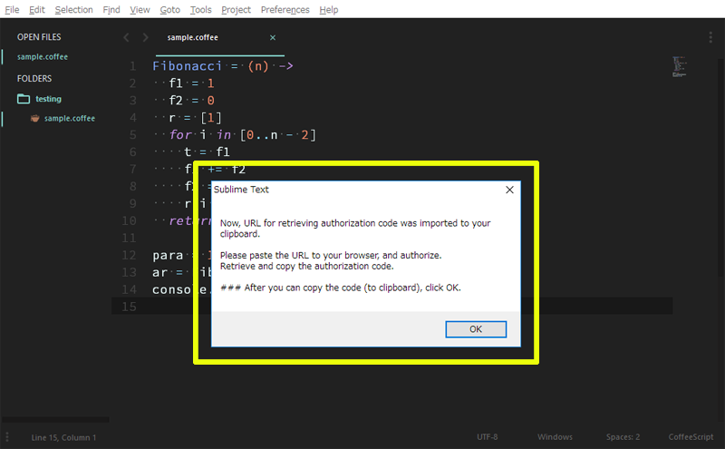
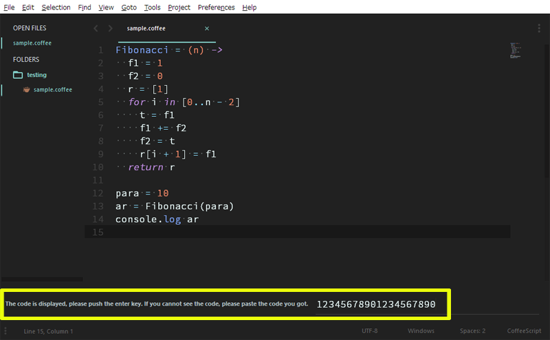
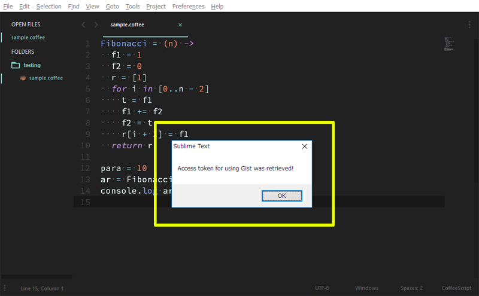

gislacks
=====

# Authorization By Sublime Text
Here, it explain about how to retrieve accest token for Gist (GitHub) and Slack by Sublime Text.

At fiest, <u>**please retrieve access token from Gist (GitHub) and Slack using each client ID and client Secret**</u>.

In order to use **Gist** and **Slack**, at first, please retrieve access token for both as following flow.

## 1. Launch Sublime Text

## 2. Push ``ctrl + alt + o`` (Windows, Linux) or ``cmd + option + o`` (OS X)
**In the case of Slack, push ``ctrl + alt + p`` (Windows, Linux) or ``cmd + option + p`` (OS X).**

## 3. Input client ID and client Secret of GitHub.

## 4. When inputed client ID and client Secret of GitHub are correct, push ok.

## 5. Get authorization code
When a dialog is displayed, this plugin copies an URL for retrieving authorization code to your clipboard, simultaneously. Please launch your browser and paste the URL. And login GitHub or Slack and push authorization button. When your browser shows error, please check the URL. The URL is included the authorization code. Please copy the whole URL to the clipboard. And back to Sublime, then push ok button on a dialog box.

## 6. Put authorization code
When you push ok button on a dialog box, you can see the code you copied at the bottom. And push enter key.

## 7. Get access token
When you push enter key, you can see the following dialog.

[Back to gislacks's README](https://github.com/tanaikech/gislacks/)
